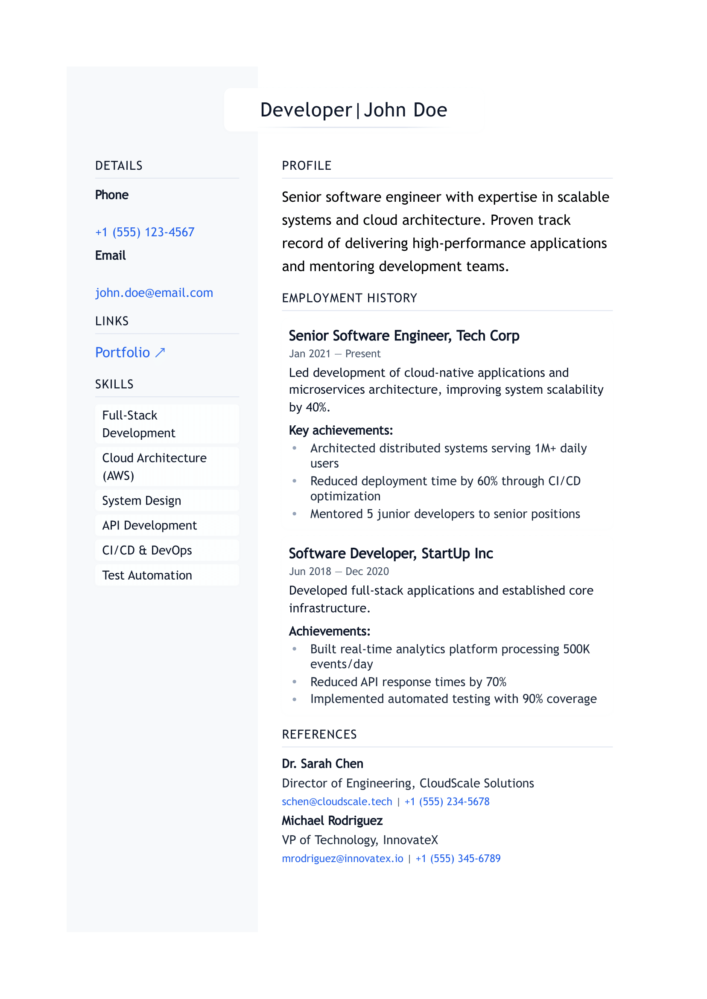

import { ArticleLayout } from '@/components/ArticleLayout'
import Image from 'next/image'

export const article = {
  author: 'Charlie Macnamara',
  date: '2024-03-20',
  title: 'Building a Markdown CV Generator with Tailwind CSS',
  description:
    'How I built a minimalist CV generator that converts markdown to beautifully styled PDFs',
}

export const metadata = {
  title: article.title,
  description: article.description,
}

export default (props) => <ArticleLayout article={article} {...props} />

After the recent overhaul of my website with Tailwind CSS, I found myself staring at my CV 
thinking, "This sucks, eh?" You know how it goes - one project leads to another. But hey, at 
least this one's actually useful!

## The Problem

We've all been there - switching between different CV formats, trying to keep everything 
consistent, and wondering if that one-pixel misalignment is going to cost us our dream job. 
After spending way too much time tweaking margins in Google Docs, I thought: "Why not leverage 
the power of Markdown and Tailwind CSS to create something better?"

## The Solution

Enter the Markdown CV Generator - a simple tool that takes your CV written in Markdown and 
transforms it into a beautifully styled PDF. Here's how it works:

1. Write your CV in Markdown (because life's too short for Word formatting)
2. Run a simple command
3. Get a professionally styled PDF that actually looks good

Here's what the Markdown looks like:

```markdown
# Developer|John Doe

## Details

**Phone**  
[+1 (555) 123-4567](tel:+15551234567)

**Email**  
[john.doe@email.com](mailto:john.doe@email.com)

## Skills

- Full-Stack Development
- Cloud Architecture (AWS)
- System Design
- API Development
```

And here's what it produces:



## How to Use It

Getting started is straightforward. First, clone the repo:

```bash
git clone https://github.com/yourusername/Markdown-CV-Generator.git
cd Markdown-CV-Generator
npm install
```

Then, either edit the example.md file or create your own, and run:

```bash
markdowncv build --default
```

That's it! Your CV will be generated as a PDF, looking sharp and professional.

## The Tech Stack

I built this using Node.js and Express for the backend, with Tailwind CSS for styling. The PDF 
generation is handled by Puppeteer, which ensures pixel-perfect rendering every time.

The best part? It's all open source, so you can customize it to your heart's content. Want to 
add your own theme? Just create a new CSS file in the themes directory.

## What's Next?

I'm planning to add more themes (because who doesn't love options?), and maybe even a web 
interface for those who prefer clicking to command lines. If you have any suggestions or want 
to contribute, the repo is open for PRs!

## Try It Out

If you're tired of fighting with Word templates or just want a CV that looks as good as your 
code, give it a try. The source code is available on GitHub, and I'd love to hear what you 
think.

Remember, your CV is often your first impression - might as well make it a good one! 